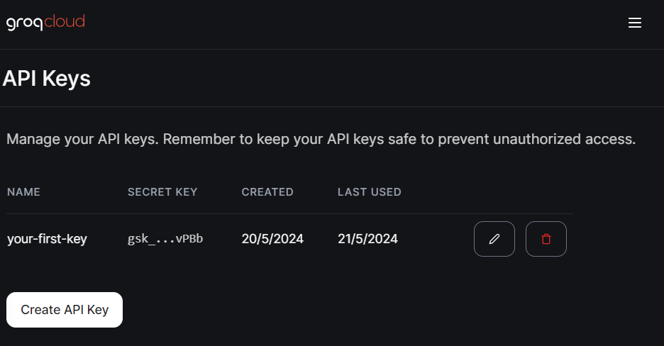

# Llaves Secretas
Para trabajar con IA generativa podemos hacerlo a través de las múltiples plataformas existentes como ChatGPT, Perplexity, Gemini, Groq, y muchísimas otras. En este curso usaremos la a Groq, por su increíble velocidad y eficiencia, además de tener un uso gratuito para desarrolladores testers. Para obtener una llave secreta de Groq, sigue estos pasos:

1. Ve a [Groq Cloud](https://console.groq.com/playground) y regístrate.

2. Una vez registrado, ve a la sección de API Keys en el menú lateral. Aquí tienes un enlace directo: [API Keys](https://console.groq.com/keys).

3. Haz clic en "Create API Key" y sigue las instrucciones para crear una nueva llave.

4. Copia la llave secreta y presiona el botón de **Run**, esto hará que LearnPack guarde la llave secreta en un archivo `.env` en la raíz del proyecto.